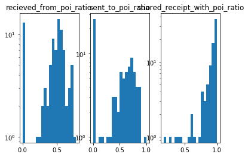
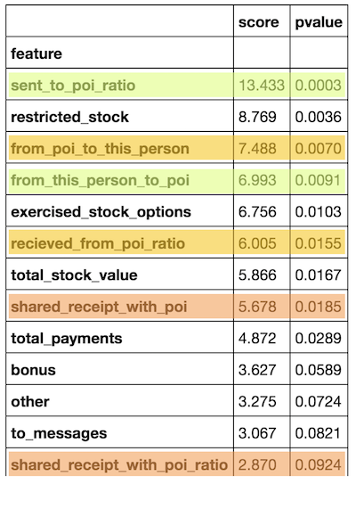
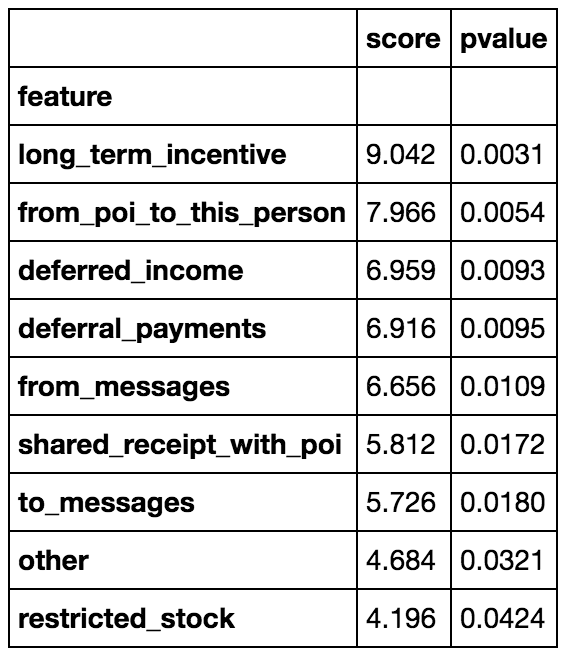

# Identify Fraud from Enron Email
## Project Overview
This project is about using machine learning techniques to indetify persons of interest (POIs) in the Enron dataset. "In 2000, Enron was one of the largest companies in the United States. By 2002, it had collapsed into bankruptcy due to widespread corporate fraud. In the resulting Federal investigation, a significant amount of typically confidential information entered into the public record, including tens of thousands of emails and detailed financial data for top executives." This data will be used in this project to build a person of interest indentifier.

## Dataset Exploration
### General
The dataset provided by Udacity contains 144 rows (persons) and 21 columns (features).
We got dataset that includes way more non-POI's than POI's (12,5% or 18 POIs), which needs to be considered when evaluating the classification algos. If an algo such as POI = False would be deployed the accuracy would already be at 87.5%, but precision at 0%.

### Missing Data
Another important note about the dataset is the amount of missing data points which make some of those features not usable in the classifier. Most extreme is `loan advanves` with 96% of values missing:

| feature       | missing values | % missing |
| ------------- | ---------- | ------ |
| loan_advances	| 139		| 0.965278
| director_fees	| 	128		| 0.888889
| restricted_stock_deferred	| 	127		| 0.881944
| deferral_payments	| 	105		| 0.729167
| deferred_income	| 	94		| 0.652778
| long_term_incentive	| 	77		| 0.534722
| bonus	| 	61		| 0.423611
| to_messages	| 	58		| 0.402778
| shared_receipt_with_poi	| 	58		| 0.402778
| from_this_person_to_poi	| 	58		| 0.402778
| from_poi_to_this_person	| 	58		| 0.402778
| from_messages	| 	58		| 0.402778
| other	| 	52		| 0.361111
| expenses	| 	48		| 0.333333
| salary	| 	48		| 0.333333
| exercised_stock_options	| 	43		| 0.298611
| restricted_stock	| 	34		| 0.236111
| total_payments	| 	21		| 0.145833
| total_stock_value	| 	18		| 0.125000

### Outliers
There were a four outliers of which two are still included in this dataset. The ones removed were TOTAL and TRAVEL AGENCY IN THE PARK, which are both no natural persons. The ones still inclueded are SKILLING JEFFREY K as well as LAY KENNETH L which have very high payments but were in the center of the fraud and should be included. Also there were two parsing mistakes that needed to be fixed.

## Feature selection
### Feature engineering
The first hypothesis that came into my mind when thinking about POI identification was: People that interacted a lot with POIs might be POIs as well. There are three measurable interactions with POIs in the dataset: sending, recieving emails as well as sharing a reciept with a POI. So I translated those interactions into ratios of total emails/receipts to know the relative amount of interactions that were done with POIs. While the email ratios are normal distributed the reciept ratio is skewed:

When analysing the impact of those new features compared to their original ones using K-best, sent_to_poi_ratio turned out to have the highest impact of all (score: 13.4, p-value 0%), but all other features performed worse:

### Feature benchmarking
I ended up using all features exept the ones I did in the identifier. I started with a set of features selected using the common univariate statistical FPR test for each feature using the standard α = 0.05 cutoff.

That feature selection performed worse than including all features as seen in the table below. I played around with different combinations but ended up using all of the features included in the original dataset as I did not achive higher precision and recall values.

| Algorithm              | precision | recall | precision selected features | recall selected features |
| ---------------------- |---------- | -----  | ---------------------- | ------------------- |
| KMeans                 | 0.034     | 0.203  | 0.058                  | 0.243               |
| SVC                    | 0.313     | 0.625  | 0.228                  | 0.494               |
| RandomForestClassifier | 0.269     | 0.123  | 0.189                  | 0.093               |

## Algorithm selection
When running the three selected algorithms on the new features vs. the old ones the old dataset achieved higher precision recall values for KMeans and SVC. As seen below SVC had the highest precision revall values, and performed better on the old dataset which is why I picked that combination.

| Algorithm              | precision | recall | precision new features | recall new features | △ precision | △ recall
| ---------------------- |---------- | -----  | ---------------------- | ------------------- | ----- |  ----- |  
| KMeans                 | 0.034     | 0.203  | 0.029                  | 0.163               | 0.005 | 0.04 |
| SVC                    | 0.313     | 0.625  | 0.272                  | 0.615               | 0.041 | 0.01 |
| RandomForestClassifier | 0.269     | 0.123  | 0.309                  | 0.157               | -0.04 | -0.034 |

I ended up using a Support Vector Machine Classifier after trying K-means Clustering and Random Forest as well. I chose those algorithms as they come from three different approaches to identify patterns which I wanted to try on the dataset.

| Algorithm     | precision  | recall |
| ------------- | ---------- | ------ |
| KMeans        | 0.025      | 0.147  |
| SVC           | 0.265      | 0.609  |
| Random Forest | 0.312      | 0.160  |

## Feature scaling
### Log scaling
While plotting the histograms of the features the highly skewed distribution of most of the features could be observed. This is very handy given the amount of missing data. Imputation using the median is appropiate given normal distribtions while it's no good fit for highly skewed data as it will change the distribution curve a lot. Also some models perform better or even require a normal distribution I applied log scaling to the features. Finally the log scaling can easily be reverted using the exponential function no information is lost.

### Impute missing values
As mentioned above the missing data was relplaced using the mean, after log scaling the features.

## Parameter Tuning
Parameter tuning is about choosing a set of optimal parameters for a learning algorithm. If the parameters are not tuned well the algortihm risks overfitting.
After chosing SVC as the algorithm to further tune I first played around with the features selected leading to include all original features in the model as those had the highest natural precision & recall. Then I moved on to optimise  parameters gamma (Kernel coefficient) and C (penalty). After reading about them and moving them around to find the optimum I eneded up achiving a precision & recall of over 0.3.

## Model Validation
### General
"In machine learning, model validation is referred to as the process where a trained model is evaluated with a testing data set. The testing data set is a separate portion of the same data set from which the training set is derived. The main purpose of using the testing data set is to test the generalization ability of a trained model (Alpaydin 2010)." In this dataset validation was done by quantifying the performance of the SVC algorithm based on confusion matrix metrics: precision and recall.
The most common mistake done is to overfit the data by choosing a bad validation metric. In this case I chose to ignore accuracy as the enron dataset is highly skewed and accuracy could be achieved by biasing towards non-pois. Given we guess all people being non pois the accuracy would already be at 86%, but precision at 0%.

First I chose the algorithm based on the highest precision and recall values and after that I tweaked the parameters, benchmarking the precison&recall differences by changing one parameter as long as there would be a negative difference to then move on to the next parameter.  

### Validation Metrics

The algorithms had the following mean precision and recall values of 1000 iterations:

| Algorithm     | precision  | recall |
| ------------- | ---------- | ------ |
| KMeans        | 0.025      | 0.147  |
| SVC           | 0.265      | 0.609  |
| Random Forest | 0.312      | 0.160  |

When optimising the performance of the SVC algorithm I chose `C=2000` and `gamma=0.0001` which lead to the following:

| Algorithm     | precision  | recall |
| ------------- | ---------- | ------ |
| SVC           | 0.314      | 0.630  |

Precision: How many selected items are relevant?  
Of all indentified POIs there are 31% which actually are POIs while 69% are non-pois.

Recall: How many relevant items are selected?
The model identified 63% of all POIs in the dataset.

## Outlook

Given the bad precision of only 31% this identifier is mostly wrong in identifying POIs from the Enron dataset. Still with a recall of 69% it is better than guessing. It turnes out that identifying Fraud or Spamm which is based on highly skewed data is very hard. To increase the performance of identification I'd suggest to look for patterns in the text of the emails. Maybe there are certain word combinations that are mostly used by POIs.
The documentation on Spamm classification which is available could be of great help there as it handles a similar problem: identifying behavioural patterns of a small group of people.
